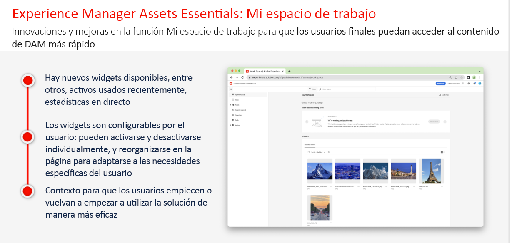
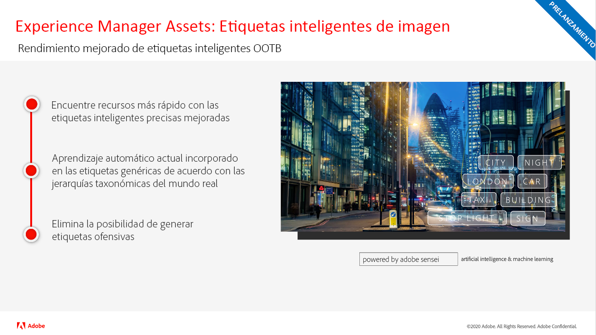
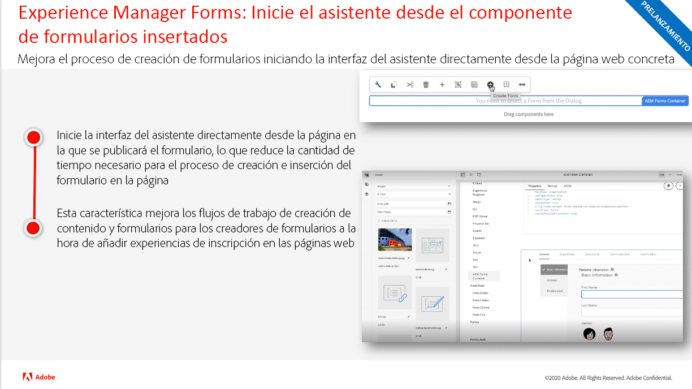
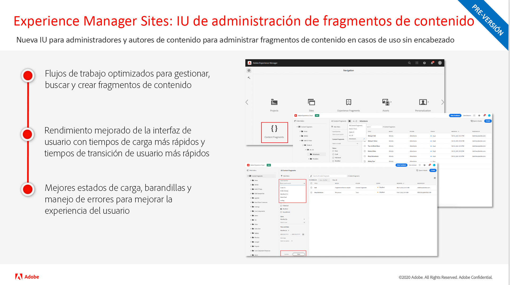

# Actualizaciones del estado de la versión de Adobe Experience Manager as a Cloud Service

Obtenga información general rápida sobre las últimas funciones de Adobe Experience Manager as a Cloud Service. Estos son vídeos cortos, de unos 10 minutos, de parte del equipo de productos de AEM que comparten los aspectos más destacados de la última versión.

## Última actualización del estado

<table style="max-width: 50%;">
  <tr>
    <td>
      
      

        <a href="./2023/2023-1-0.md">
          <strong>Versión | 2023.1.0</strong>
           
        </a>
          <em>Fecha de publicación: febrero 2023 </em>
      

      

        <a href="https://experienceleague.adobe.com/docs/experience-manager-cloud-service/content/release-notes/release-notes/release-notes-current.html?lang=es">Notas de la versión</a>
      

    </td>
  </tr>  
</table>

## Actualizaciones del estado anteriores

<table style="max-width: 50%;">
  <tr>
    <td>
      
      

        <a href="./2022/2022-10-0.md">
          <strong>Versión | 2022.10.0</strong>
           
        </a>
          <em>Fecha de versión 13 de octubre de 2022</em>
      

      

        <a href="https://experienceleague.adobe.com/docs/experience-manager-cloud-service/content/release-notes/release-notes/release-notes-current.html?lang=es">Notas de la versión</a>
      

    </td>  
    <td>
      
      

        <a href="./2022/2022-8-0.md">
          <strong>Versión | 2022.8.0</strong>
           
        </a>
          <em>Fecha de publicación  1 de septiembre de 2022 </em>
      

      

        <a href="https://experienceleague.adobe.com/docs/experience-manager-cloud-service/content/release-notes/release-notes/release-notes-current.html?lang=es">Notas de la versión</a>
      

    </td>
    <td>
      
      

        <a href="./2022/2022-7-0.md">
          <strong>Versión | 2022.7.0</strong>
           
        </a>
          <em>Fecha de publicación: 8 de agosto de 2022 </em>
      

      

        <a href="https://experienceleague.adobe.com/docs/experience-manager-cloud-service/content/release-notes/release-notes/release-notes-current.html?lang=es">Notas de la versión</a>
      

    </td>
  </tr>
  <tr> 
    <td>
      
      

        <a href="./2022/2022-6-0.md">
          <strong>Versión | 2022.6.0</strong>
         
      </a>
        <em>Fecha de publicación: 30 de junio de 2022 </em>
      

      

        <a href="https://experienceleague.adobe.com/docs/experience-manager-cloud-service/content/release-notes/release-notes/release-notes-current.html?lang=es">Notas de la versión</a>
      

    </td>
    <td>
      
      

        <a href="./2022/2022-5-0.md">
          <strong>Versión | 2022.5.0</strong>
         
      </a>
        <em>Fecha de publicación: 9 de junio de 2022 </em>
      

      

        <a href="https://experienceleague.adobe.com/docs/experience-manager-cloud-service/content/release-notes/release-notes/release-notes-current.html?lang=es">Notas de la versión</a>
      

    </td>
    <td>
      
      

        <a href="./2022/2022-4-0.md">
        <strong>Versión | 2022.4.0</strong>
         
      </a>
        <em>Publicada el 5 de mayo de 2022</em>
      

      

        <a href="https://experienceleague.adobe.com/docs/experience-manager-cloud-service/content/release-notes/release-notes/release-notes-current.html?lang=es">Notas de la versión</a>
      

    </td>
  </tr>
  <tr> 
    <td>
      
      

        <a href="./2022/2022-3-0.md">
          <strong>Versión | 2022.3.0</strong>
         
      </a>
        <em>Publicada el 31 de marzo de 2022 </em>
      

      

        <a href="https://experienceleague.adobe.com/docs/experience-manager-cloud-service/content/release-notes/release-notes/release-notes-current.html?lang=es">Notas de la versión</a>
      

    </td>
    <td>
      
      

        <a href="./2022/2022-1-0.md">
          <strong>Versión | 2022.1.0</strong>
         
      </a>
        <em>Publicada el jueves, 3 de febrero de 2022 </em>
      

      

        <a href="https://experienceleague.adobe.com/docs/experience-manager-cloud-service/content/release-notes/release-notes/2022/release-notes-2022-1-0.html?lang=es">Notas de la versión</a>
      

    </td>
    <td>
      
      

      <a href="./2021/2021-11-0.md">
          <strong>Versión | 2021.11.0</strong>
         
      </a>
    <em>Publicada el 16 de diciembre de 2021</em>
      

      

        <a href="https://experienceleague.adobe.com/docs/experience-manager-cloud-service/content/release-notes/release-notes/2021/release-notes-2021-11-0.html?lang=es">Notas de la versión</a>
      

    </td>
  </tr>
</table>

